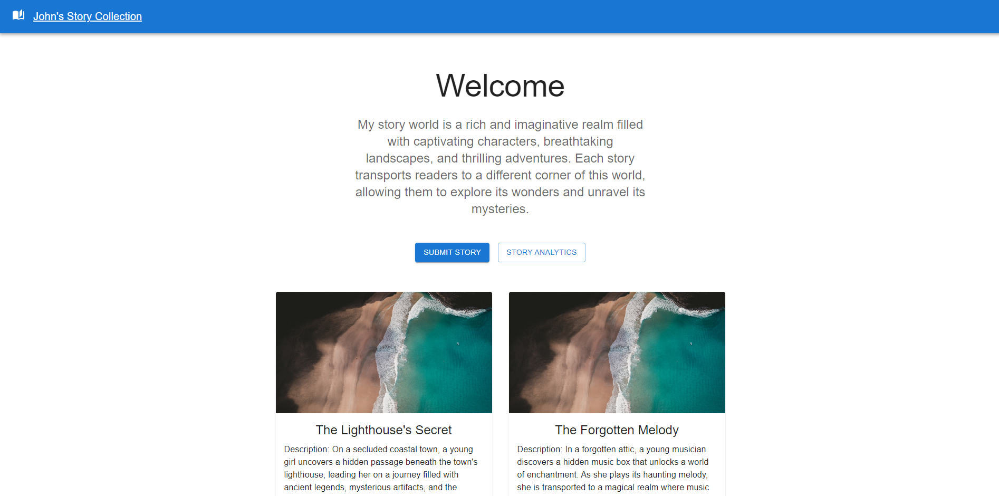
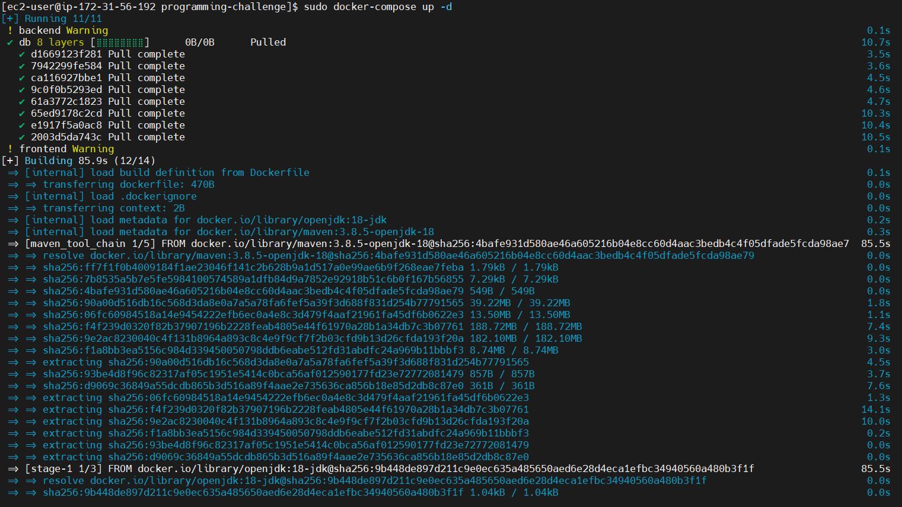
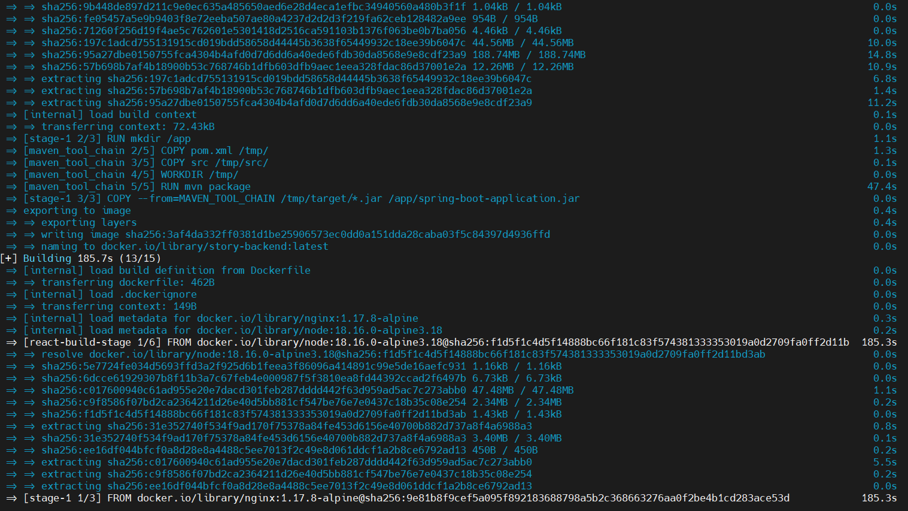
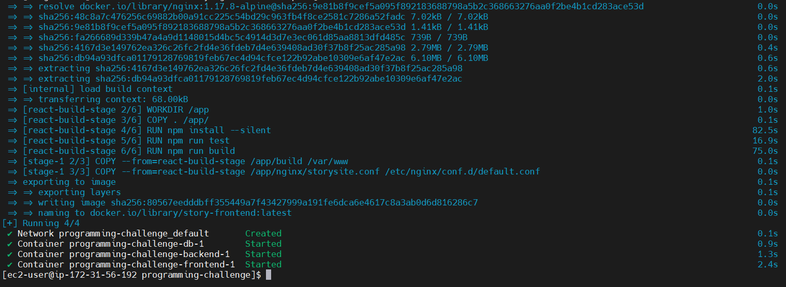

# Story Preservation Website

This project aims to create a website that allows users to store and preserve stories in a
visually appealing manner. The website will also generate a graphic image (*.png) with the stories embedded, and provide
features for tracking story popularity through view and download logs. Additionally, a simple chart will be displayed on
each story's page to visualize the data.

## Technologies Used
- Front-end: React, Material-UI
- Back-end: Spring boot, Cache
- Database: Mariadb
- Charting Library: Chart.js
- Others: Nginx

## Getting Started
To run the website locally, follow these steps:
1. Prepare docker and docker-compose environment in Ubuntu OS
2. Change the current working directory that contains docker-compose.yml file
3. Run the command with sudo docker-compose up -d
4. Be patient for the image build and run the unit tests process
5. Wait until all the services are up.
6. Access the website in your browser at http://{ip-address}

## Preview

## Docker-compose log

